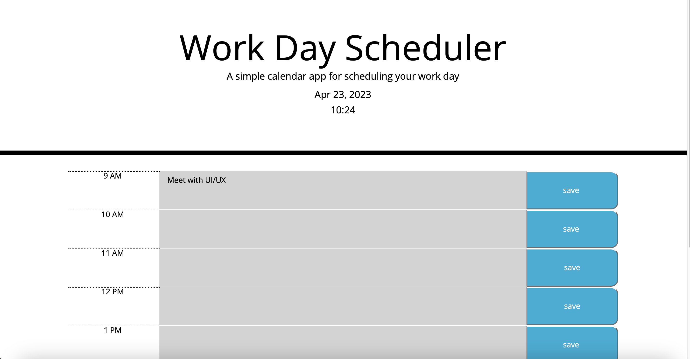
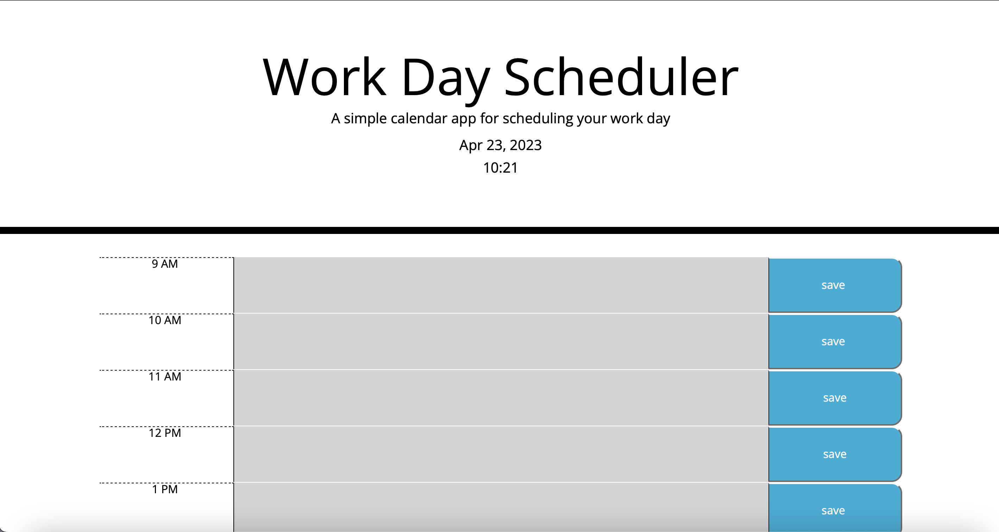

# WORKDAY-SCHEDULER

#DESCRIPTION

To build a work-day scheduler  to add important events to a daily planner to manage time effectively

#DEPLOYED WEBSITE

[Website](https://priyankav89.github.io/Workdayscheduler/)

#USAGE

WHEN you open the planner, THEN the current day is displayed at the top of the calendar.

WHEN you scroll down,THEN you are presented with time blocks for standard business hours.

WHEN you view the time blocks for that day,THEN each time block is color-coded to indicate whether it is in the past, present, or future.

WHEN you click into a time block,THEN you can enter an event.

WHEN you click the save button for that time block, THEN the text for that event is saved in local storage.

WHEN you refresh the page,THEN the saved events persist.

Screenshots

#LICENSE

MIA
